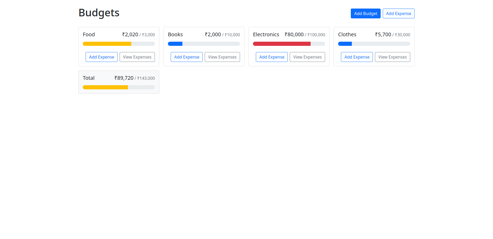
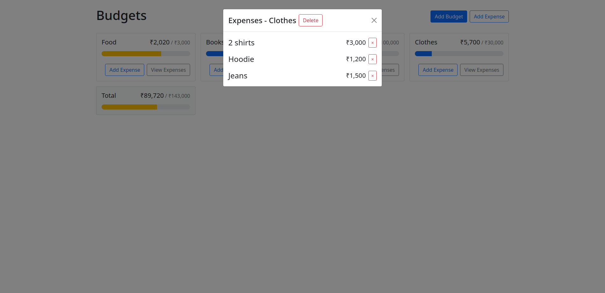

# React Budget App

A Budget tracking app created using ReactJS. [Demo using github pages](https://maryll-castelino.github.io/Budget-app)

To run the project locally :

1. ```
   git clone https://github.com/Maryll-castelino/Budget-app.git
   ```
2. ```
   cd Budget-app
   ```
3. ```
   npm install
   ```
4. ```
   npm start
   ```



